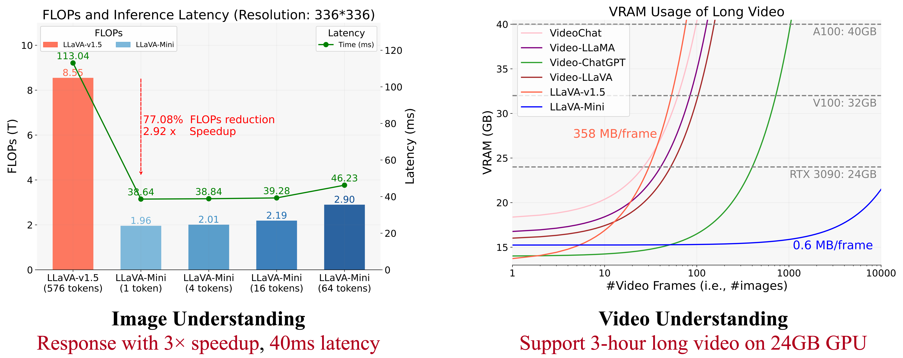
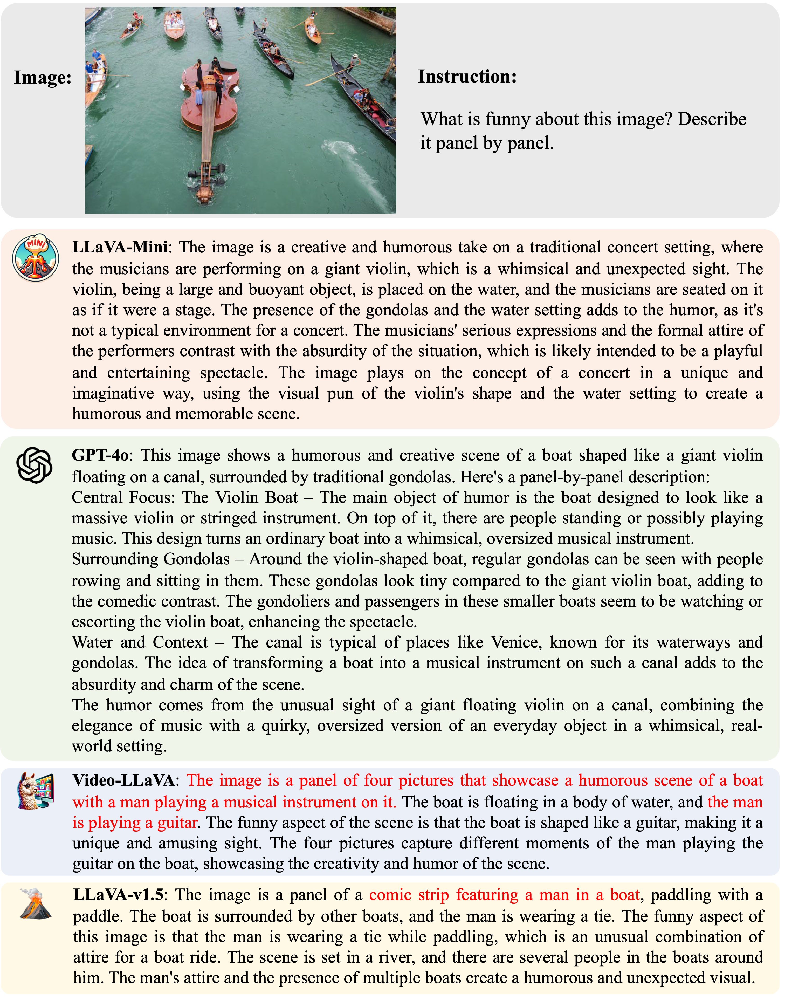
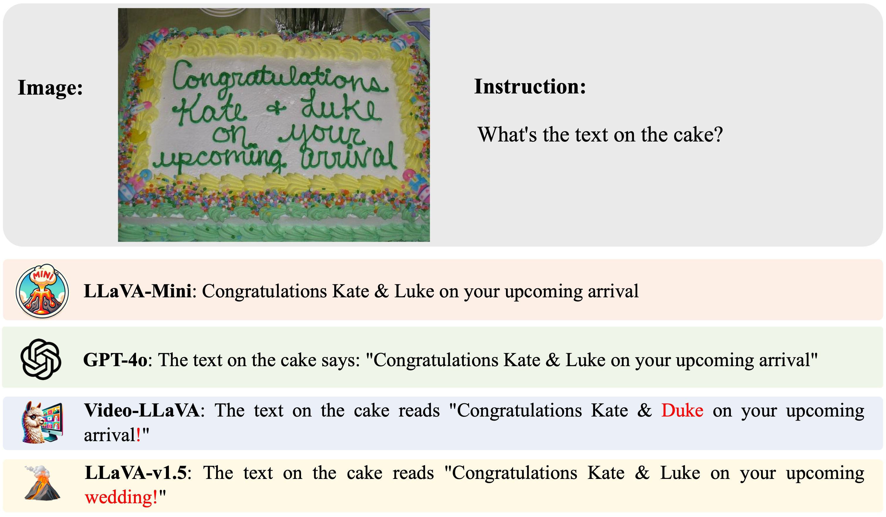
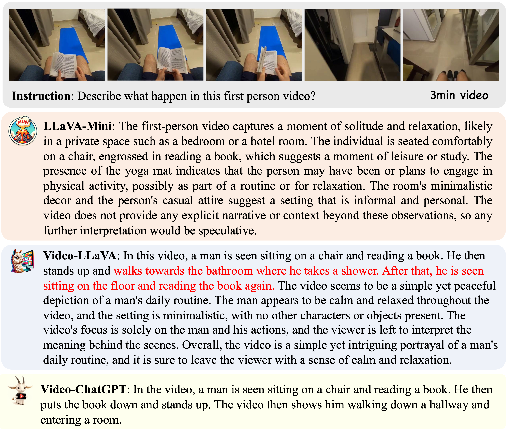

# Dynamic LLaVA-Mini: Efficient Image and Video Large Multimodal Models with One Vision Token

[](https://arxiv.org/abs/2501.03895)
[](https://huggingface.co/ICTNLP/llava-mini-llama-3.1-8b)
[](https://github.com/ictnlp/LLaVA-Mini)

> **[Shaolei Zhang](https://zhangshaolei1998.github.io/), [Qingkai Fang](https://fangqingkai.github.io/), [Zhe Yang](https://nlp.ict.ac.cn/yjdw/xs/ssyjs/202210/t20221020_52708.html), [Yang Feng*](https://people.ucas.edu.cn/~yangfeng?language=en)**


LLaVA-Mini is a unified large multimodal model that can support the understanding of images, high-resolution images, and videos in an efficient manner. Guided by the interpretability within LMM, LLaVA-Mini significantly improves efficiency while ensuring vision capabilities. [Model](https://huggingface.co/ICTNLP/llava-mini-llama-3.1-8b) and [demo](#-demo) of LLaVA-Mini are available now!

> [!Note]
> LLaVA-Mini only requires **1 token** to represent each image, which improves the efficiency of image and video understanding, including:
> - **Computational effort**: 77% FLOPs reduction
> - **Response latency**: reduce from 100 milliseconds to 40 milliseconds
> - **VRAM memory usage**: reduce from 360 MB/image to 0.6 MB/image, support 3-hour video processing


<p align="center" width="100%">

</p>

💡**Highlight**:
1. **Good Performance**: LLaVA-Mini achieves performance comparable to LLaVA-v1.5 while using only 1 vision token instead of 576 (compression rate of 0.17%).
2. **High Efficiency**: LLaVA-Mini can reduce FLOPs by 77%, deliver low-latency responses within 40 milliseconds, and process over 10,000 frames of video on the GPU hardware with 24GB of memory.
3. **Insights**: To develop LLaVA-Mini, which reduces vision tokens while maintaining visual understanding, we conduct a preliminary analysis to explore how large multimodal models (LMMs) process visual tokens. Please refer to our [paper](https://arxiv.org/pdf/2501.03895) for a detailed analysis and our conclusions.

## 🖥 Demo
<p align="center" width="100%">

</p>

- Download LLaVA-Mini model from [here](https://huggingface.co/ICTNLP/llava-mini-llama-3.1-8b).

- Run these scripts and Interact with LLaVA-Mini in your browser:

  ```bash
  # Launch a controller
  python -m llavamini.serve.controller --host 0.0.0.0 --port 10000 &

  # Build the API of LLaVA-Mini, if the VRAM memory is less than 20GB, try using --load-8bit
  CUDA_VISIBLE_DEVICES=0  python -m llavamini.serve.model_worker --host 0.0.0.0 --controller http://localhost:10000 --port 40000 --worker http://localhost:40000 --model-path ICTNLP/llava-mini-llama-3.1-8b --model-name llava-mini &

  # Start the interactive interface
  python -m llavamini.serve.gradio_web_server --controller http://localhost:10000 --model-list-mode reload  --port 7860
  ```

## 🔥 Quick Start
### Requirements
- Install packages:

  ```bash
  conda create -n llavamini python=3.10 -y
  conda activate llavamini
  pip install -e .
  pip install -e ".[train]"
  pip install flash-attn --no-build-isolation
  ```

### Command Interaction
- Image understanding, using `--image-file`.
- If the VRAM memory is less than 20GB, try using `--load-8bit`.

  ```bash
  # Image Understanding
  CUDA_VISIBLE_DEVICES=0 python llavamini/eval/run_llava_mini.py \
      --model-path  ICTNLP/llava-mini-llama-3.1-8b \
      --image-file llavamini/serve/examples/baby_cake.png \
      --conv-mode llava_llama_3_1 --model-name "llava-mini" \
      --query "What's the text on the cake?"
  ```

- Video understanding, using `--video-file`:

  ```bash
  # Video Understanding
  CUDA_VISIBLE_DEVICES=0 python llavamini/eval/run_llava_mini.py \
      --model-path  ICTNLP/llava-mini-llama-3.1-8b \
      --video-file llavamini/serve/examples/fifa.mp4 \
      --conv-mode llava_llama_3_1 --model-name "llava-mini" \
      --query "What happened in this video?"
  ```

### Reproduction and Evaluation

- Refer to [Evaluation.md](docs/Evaluation.md) for the evaluation of LLaVA-Mini on image/video benchmarks.

### Cases
- LLaVA-Mini achieves high-quality image understanding and video understanding.

<p align="center" width="100%">

</p>

<details>
<summary>More cases</summary>
<p align="center" width="100%">

</p>

<p align="center" width="100%">

</p>

<p align="center" width="100%">

</p>

</details>

- LLaVA-Mini dynamically compresses image to capture important visual information (brighter areas are more heavily weighted during compression).

<p align="center" width="100%">

</p>

## 🤝 Acknowledgement
- [LLaVA](https://github.com/haotian-liu/LLaVA): LLaVA-Mini is built upon LLaVA codebase, a large language and vision assistant.
- [Video-ChatGPT](https://github.com/mbzuai-oryx/Video-ChatGPT): The training of LLaVA-Mini involves the video instruction data provided by Video-ChatGPT.
- [LLaVA-OneVision](https://github.com/LLaVA-VL/LLaVA-NeXT): The training of LLaVA-Mini involves the image instruction data provided by LLaVA-OneVision.

## 🖋Citation

If this repository is useful for you, please cite as:

```
@misc{llavamini,
      title={LLaVA-Mini: Efficient Image and Video Large Multimodal Models with One Vision Token}, 
      author={Shaolei Zhang and Qingkai Fang and Zhe Yang and Yang Feng},
      year={2025},
      eprint={2501.03895},
      archivePrefix={arXiv},
      primaryClass={cs.CV},
      url={https://arxiv.org/abs/2501.03895}, 
}
```

If you have any questions, please feel free to submit an issue or contact `zhangshaolei20z@ict.ac.cn`.
